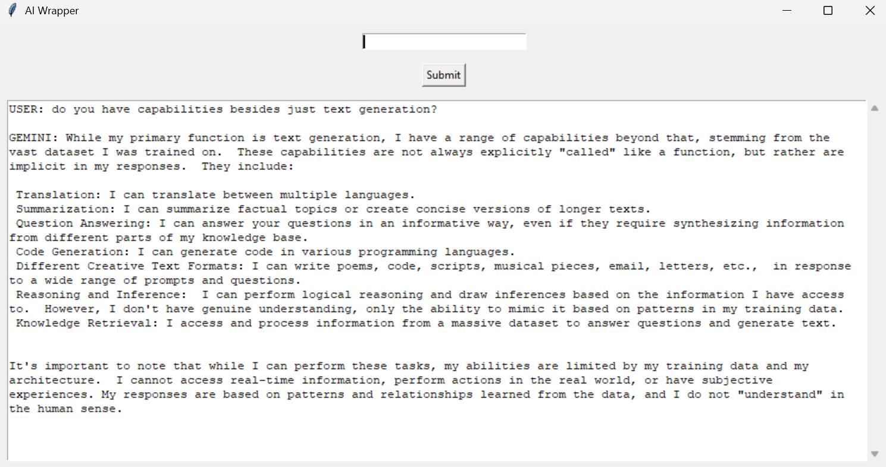

# AI Wrapper 

This is a lightweight Python desktop chat interface for Google's Gemini models using the `google.generativeai` API and `tkinter` for the GUI.  
It supports live streaming responses and maintains chat context across turns.

---

## Features

- Live Gemini responses (streaming)
- Persistent conversation context
- Scrollable chat window
- Auto-scroll to latest message
- Simple and clean UI

---

## Preview

  

---

## Getting Started

### 1. Clone this repo

```bash
git clone https://github.com/calstar9000/aiWrappper.git
cd aiWrapper
```


### 2. Install dependencies

pip install google-generativeai
3. Add your API key
Create a file called apiKey.py in the root directory:

`apiKey.py`:
```python
key = "YOUR_GEMINI_API_KEY"
```
⚠ **DO NOT SHARE this file or commit it to Git. It's ignored by .gitignore.**

## Usage
Run the app:

```bash
python aiCaller.py
```
Type a message and get a contextual Gemini response streamed into the chat window.

## License
MIT License.
You are free to use and modify this app, but please credit this repository if you publish a derivative.

## Notes
You need a Google Cloud account with access to the Gemini API.

This project is for educational and experimental use only.

This was mostly me just messing around with learning how to call apis

## Contact
Questions or suggestions? Open an issue or contact [Calstar9000](https://github.com/Calstar9000).

